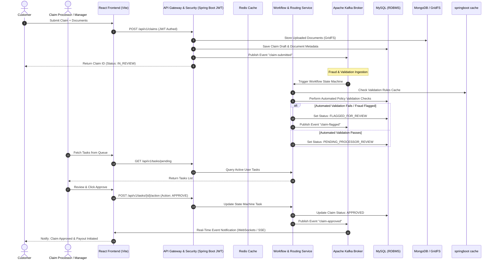
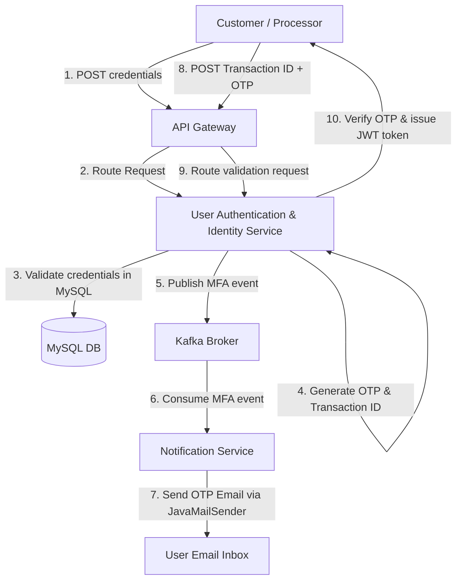
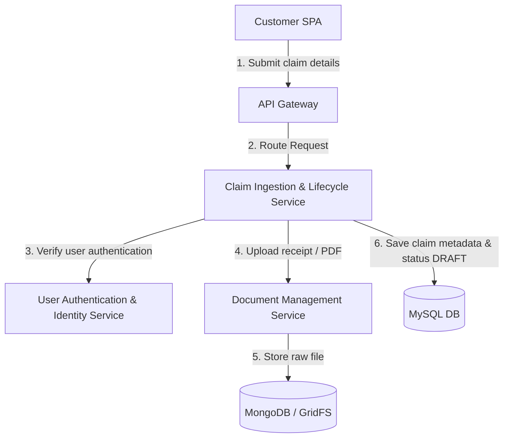
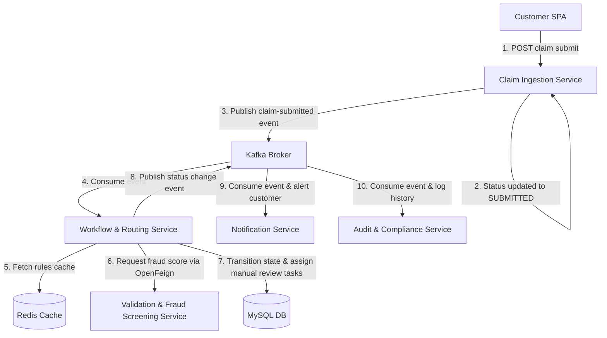
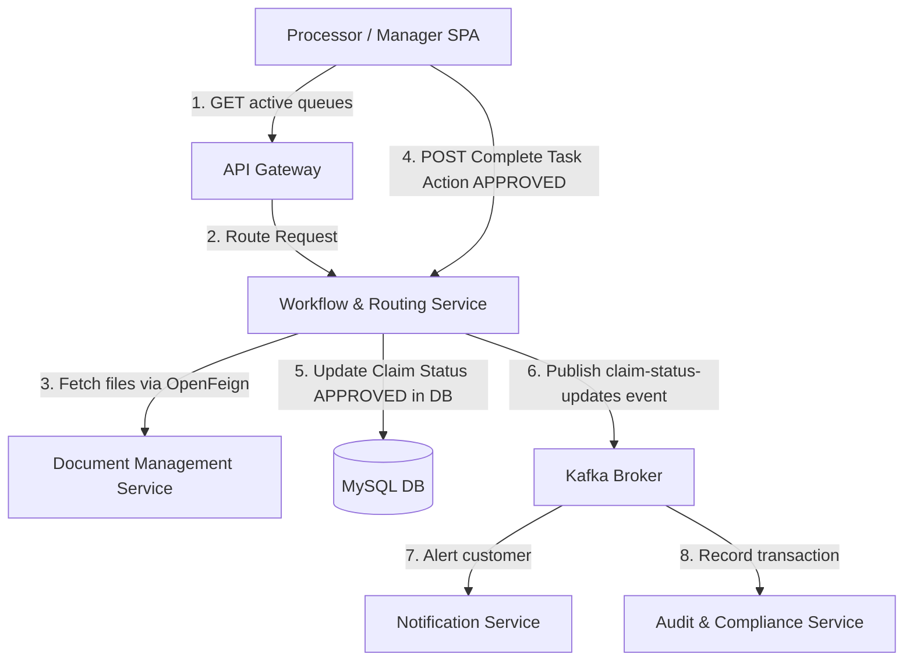

# Insurance Claim Processing and Approval System

An enterprise-grade, high-performance, and audit-compliant digital workflow system designed to automate and streamline the insurance claim life cycle. This application transitions the company from slow, error-prone, paper/email-based operations to a modern, automated, and secure digital platform.

---

## Table of Contents
1. [Business Problem & Use Cases](#1-business-problem--use-cases)
2. [User Roles & Access Levels](#2-user-roles--access-levels)
3. [System Architecture & End-to-End Flow](#3-system-architecture--end-to-end-flow)
4. [Technology Stack](#4-technology-stack)
5. [Microservices Intercommunication & Caching Design](#5-microservices-intercommunication--caching-design)
6. [Microservices Request Flow Walkthrough](#6-microservices-request-flow-walkthrough)
7. [Microservices & Complete API Endpoints Directory](#7-microservices--complete-api-endpoints-directory)
8. [Workflow State Machine & Transition Design](#8-workflow-state-machine--transition-design)
9. [Observability & Monitoring Infrastructure](#9-observability--monitoring-infrastructure)
10. [Testing & Quality Assurance](#10-testing--quality-assurance)

---

## 1. Business Problem & Use Cases

### The Problem
The insurance company processes thousands of claims monthly. Currently, claims are managed manually using email threads, spreadsheets, and paper documents. This manual approach results in:
*   **Slow Approvals:** Claims take weeks to process, leading to low customer satisfaction.
*   **Manual Verification Errors:** Lack of automated checks leads to incorrect data entry and missed validation rules.
*   **Lack of Audit Trail:** Difficulty in tracking who approved or modified a claim, posing security risks.
*   **Compliance Challenges:** Failure to adhere to regulatory requirements (e.g., HIPAA, GDPR, or state insurance laws) due to unstructured data storage.

### Use Cases
*   **UC1: Self-Service Claim Submission:** Customers upload claim details (policy number, loss type, date, amount) along with supporting documents (receipts, police reports, damage photos).
*   **UC2: Dynamic Status Tracking:** Customers receive real-time updates as their claim shifts across different workflow states.
*   **UC3: Automated Validation & Fraud Screening:** The backend validates policy details against MySQL and evaluates potential fraud markers using a rules engine.
*   **UC4: Workflow Routing & Task Escalation:** Claims are routed to specific processor queues based on claim type, value, and complexity. High-value claims are automatically escalated to managers.
*   **UC5: Multi-Level Approval Operations:** Processors and managers review files, request additional documents, approve payouts, or reject claims with documented rationales.
*   **UC6: Strict Regulatory Auditing:** Every workflow step, user action, and approval decision is logged immutably for compliance reporting.
*   **UC7: Two-Factor Authentication (2FA):** Secure account access requiring users to enter a time-sensitive One-Time Password (OTP) dispatched via email.

---

## 2. User Roles & Access Levels

The system implements Role-Based Access Control (RBAC) enforced by Spring Security and JWT.

| Role | Permissions & Scope | Typical Actions |
| :--- | :--- | :--- |
| **Customer** | Scope restricted to own claims and profile. | Submit claims, upload supporting files, view progress, submit requested documents. |
| **Claim Processor** | Access to standard queue. | Review assigned claims, verify documents, flag potential fraud, request documents, recommend approval/rejection. |
| **Claim Manager (Approver)** | Full approval queue and escalation access. | Approve/reject high-value claims ($5,000+), override flags, reassign tasks, execute final payouts. |
| **Compliance Officer (Auditor)** | Read-only access to all transaction trails. | Export logs, run regulatory compliance checks, audit fraud reports, review historical claims. |
| **System Administrator** | Global configuration access. | Manage user accounts, configure fraud rule weights, update system constants. |

---

## 3. System Architecture & End-to-End Flow

The application leverages an event-driven, microservices-ready layered architecture:



### Detailed Execution Stages
1.  **Ingestion & Encryption:** The React frontend authenticates users via Spring Security JWT. Upon claim submission, files are sent to the REST API.
2.  **Unstructured Data Hand-off:** Large binary files (PDFs, images) bypass MySQL and go directly to MongoDB GridFS. MongoDB returns unique object identifiers, which are saved in the MySQL Claim database.
3.  **Decoupled Orchestration:** Spring Boot posts a `claim-submitted` message to Kafka. A dedicated workflow consumer picks up the event and initializes a **Workflow & Routing state transition**.
4.  **Automated Filtering & Rules:** The Workflow Service executes automated business rule checks (e.g., checking if the policy is active and if the claim date is within the policy coverage window). If any rule fails, the workflow flags the claim and suspends auto-approval.
5.  **Interactive Task Execution:** If manual inspection is required, the Workflow Service registers a pending task for the designated role. Claim Processors fetch this task via REST endpoints that interface directly with the Workflow Service database.
6.  **Audit Persistence:** Once approved/rejected, the final state is written to MySQL, an event is emitted to Kafka to notify the customer, and a structural log is captured by the ELK stack for auditing.

---

## 4. Technology Stack

### Core Frameworks
*   **Backend:** Spring Boot (Java 17/21) — Provides the core REST APIs, dependency injection, and data access layers.
*   **Security:** Spring Security & JWT — Implements token-based authorization, request filtering, and stateless session management.
*   **Mailing:** JavaMailSender (Spring Boot Starter Mail) — Dispatches email alerts and OTP tokens for 2-Factor Authentication (2FA).
*   **Frontend:** React (SPA) — Rich user interface utilizing state managers (Redux Toolkit) and Axios for API integration.

### Data & Caching Layers
*   **RDBMS (MySQL):** Stores structured business data (users, roles, claim records, transaction tables, and workflow schema).
*   **NoSQL (MongoDB & GridFS):** GridFS chunks and stores large files (supporting documents, claim receipts, and damage images) without bloating the RDBMS.
*   **Caching Provider (Redis):** Serves as the caching backend backing the Spring Cache abstraction.
*   **Cache Wrapper:** Spring Cache Abstraction (`@Cacheable`, `@CachePut`, `@CacheEvict`) — Integrates caching configurations into the services code seamlessly.

### Messaging & Middleware
*   **Messaging (Apache Kafka):** Handles high-throughput asynchronous communication between ingestion, notification, and auditing workflows.

### Infrastructure & Operations
*   **Build Tool:** Apache Maven
*   **Observability:** Prometheus (metrics scraper) + Grafana (dashboard visualization)
*   **Logging:** ELK Stack (Elasticsearch, Logstash, Kibana) for centralized indexing and searching.

---

## 5. Microservices Intercommunication & Caching Design

To maintain decoupling and loose integration in this enterprise setup, microservices communicate using two design patterns: **Synchronous REST clients** and **Asynchronous Message brokers**. Additionally, database read requests are optimized using **Spring Cache**.

### 5.1 Synchronous Communication (Spring Cloud OpenFeign)
When a microservice requires immediate data validation, access confirmation, or metadata from another service, it invokes a REST call using **OpenFeign** clients.
*   **Service Authentication Check:** When the Claim or Document service receives a request, it calls the `Auth Service` via OpenFeign to validate the JWT token validity and user roles.
*   **Claim Document Association:** The `Claim Service` uses OpenFeign to call the `Document Storage Service` to verify that the required supporting documents have been successfully loaded and archived in GridFS before transitioning claim state.
*   **Fraud Rule Evaluation:** The `Workflow & Routing Service` calls the `Fraud Screening Service` synchronously during automated routing to obtain risk scores.

### 5.2 Asynchronous Event-Driven Messaging (Apache Kafka)
For operations that are non-blocking, distributed, or take significant processing time, services publish events to **Apache Kafka** topics.
*   **Topic: `claim-submissions`**
    *   *Producer:* `Claim Ingestion Service`
    *   *Consumer:* `Workflow & Routing Service` and `Audit Service`.
*   **Topic: `claim-validation-results`**
    *   *Producer:* `Fraud Screening Service`
    *   *Consumer:* `Workflow & Routing Service`.
*   **Topic: `claim-status-updates`**
    *   *Producer:* `Workflow & Routing Service`
    *   *Consumer:* `Notification Service` and `Audit Service`.
*   **Topic: `mfa-events`**
    *   *Producer:* `Auth Service` (emitted when 2FA is triggered during login).
    *   *Consumer:* `Notification Service` (reads payload to extract email targets and dispatch generated OTP tokens).

### 5.3 Spring Boot Cache Integration (Redis Provider)
Caching is implemented declaratively across services using Spring Cache annotations, using Redis as the centralized cache broker:
*   **Rules Cache (`@Cacheable("validationRules")`):** Caches policy criteria and fraud threshold parameters to prevent database roundtrips during workflow execution.
*   **User Session & Role Cache (`@Cacheable("userSessions")`):** Stores user privilege levels and profile variables temporarily to speed up Gateway-level JWT claims validations.
*   **Token Blacklist Management (`@CacheEvict` / `@CachePut`):** Revoked JWT tokens are stored in the Redis cache during logouts, enabling stateless authorization checking without persistent SQL checks.
*   **Claim Status Caching (`@Cacheable(value="claimDetails", key="#id")`):** Speeds up high-frequency customer checks on their claim tracking status pages.

---

## 6. Microservices Request Flow Walkthrough

The interactions among the microservices are categorized into distinct operational transaction flows:

### Flow A: Secure Log In with 2-Factor Authentication (2FA)



1. **Authentication Ingest:** The user submits their username and password via the React SPA which passes through the API Gateway to the **User Authentication & Identity Service**.
2. **Credential Validation:** The Authentication Service checks the credentials against MySQL database.
3. **OTP Dispatched:** If verified, the service generates a one-time passcode (OTP) and publishes a notification event to the Kafka topic `mfa-events`.
4. **Mailing Transmission:** The **Notification Service** consumes the event and utilizes `JavaMailSender` to send the OTP email containing the time-sensitive code.
5. **Token Verification:** The user inputs the OTP. The Identity Service validates it and returns a signed security JWT token, caching user permissions in Redis for subsequent gateway filter checks.

---

### Flow B: Claim Creation & Document Archival



1. **Token Verification:** The Customer SPA makes a request to the **Claim Ingestion Service** which calls the **Authentication Service** via Spring Cloud OpenFeign to check token status.
2. **Document Ingestion:** The customer uploads supporting documents. The Claim Service forwards the files to the **Document Management Service** via OpenFeign.
3. **Database Segregation:** The Document Service stores the binary file chunks in **MongoDB GridFS**, returning unique GridFS ObjectIDs.
4. **Draft Persistence:** The Claim Ingestion Service updates the relational schema in **MySQL** with the claim details and GridFS record pointers, returning a confirmation status of `DRAFT`.

---

### Flow C: State Machine Triggering & Automated Rule Checking



1. **Submission Event:** The customer confirms submission of the claim draft, causing the Claim Ingestion Service to change the state to `SUBMITTED` and publish a `claim-submitted` message to Kafka.
2. **Workflow Ingestion:** The **Workflow & Routing Service** consumes the event, spawning a state execution thread.
3. **Rule Verification:** The Workflow Service checks rule configurations cached in **Redis** via Spring Cache.
4. **Fraud Call:** The Workflow Service invokes the **Validation & Fraud Screening Service** via OpenFeign to obtain policy violation and duplicate filing risk scores.
5. **State Branching:**
   * **If flagged:** The Workflow Service updates the claim state to `FLAGGED_FOR_REVIEW` in MySQL and assigns a task to the Manager queue.
   * **If clean:** The Workflow Service transitions the claim state to `PENDING_REVIEW` in MySQL and places the task in the General Processor queue.
6. **Kafka Notifications:** A `claim-status-update` event is dispatched to Kafka. The **Notification Service** emails status details to the customer. Concurrently, the **Audit Service** writes compliance logs.

---

### Flow D: Manual Approval & Claim Payout



1. **Task Retrieval:** The Processor SPA fetches tasks from the **Workflow & Routing Service**.
2. **Evidence Inspection:** The Processor reviews the claim document files. The SPA requests the files, and the Workflow Service fetches metadata from the **Document Management Service** via OpenFeign.
3. **Decision Execution:** The Processor submits an `APPROVED` action. The Workflow Service performs a state check, updates the status in MySQL to `APPROVED`, and posts an update event to Kafka.
4. **Final Distribution:**
   * The **Notification Service** consumes the event and sends a confirmation email.
   * The **Audit Service** registers the final manager action.

---

## 7. Microservices & Complete API Endpoints Directory

Below is the complete list of system endpoints, complete with expected inputs, outputs, security requirements, and transport mechanisms.

### 7.1 User Authentication & Identity Service
Manages authentication credentials, JWT token lifecycle, role assignment, and 2-Factor Authentication (2FA).

*   **Register New Account**
    *   *Endpoint:* `POST /api/v1/auth/register`
    *   *Security:* Public
    *   *Input Payload:* Username, email, raw password, selected role (e.g., Customer, Processor).
    *   *Output Payload:* Status message, created user ID, timestamp.
*   **User Login (Step 1 - Credentials Check)**
    *   *Endpoint:* `POST /api/v1/auth/login`
    *   *Security:* Public
    *   *Input Payload:* Username, raw password.
    *   *Output Payload:* Authentication status indicator. If credentials are correct and 2FA is enabled, generates a temporary transaction ID and triggers an OTP verification code sent via `JavaMailSender`.
*   **Verify 2FA OTP (Step 2 - Login Completion)**
    *   *Endpoint:* `POST /api/v1/auth/login/mfa/verify`
    *   *Security:* Public (Requires validation transaction ID)
    *   *Input Payload:* MFA transaction ID, verification code (OTP).
    *   *Output Payload:* JWT access token, expiration time, user roles.
*   **Enable/Disable 2FA**
    *   *Endpoint:* `POST /api/v1/auth/mfa/setup`
    *   *Security:* Authenticated (JWT required)
    *   *Input Payload:* Toggle switch (boolean value).
    *   *Output Payload:* 2FA setup status. If enabling, sends a verification email using `JavaMailSender` to confirm the user's registered email channel.
*   **User Logout**
    *   *Endpoint:* `POST /api/v1/auth/logout`
    *   *Security:* Authenticated (JWT required)
    *   *Input Payload:* None (Token read from authorization header)
    *   *Output Payload:* Session termination confirmation. Blacklists JWT in Redis.
*   **Get User Profile**
    *   *Endpoint:* `GET /api/v1/auth/me`
    *   *Security:* Authenticated (JWT required)
    *   *Input Payload:* None
    *   *Output Payload:* Current authenticated user details (name, email, role).

### 7.2 Claim Ingestion & Lifecycle Service
Operates CRUD controls on claims and interfaces with the Workflow Service via Kafka events.

*   **Create Claim Draft**
    *   *Endpoint:* `POST /api/v1/claims`
    *   *Security:* Authenticated (Role: Customer)
    *   *Input Payload:* Policy number, claim amount, type of loss, date of occurrence, loss description.
    *   *Output Payload:* Draft claim details, generated Claim ID, status (DRAFT), creation timestamp.
*   **Submit Claim for Processing**
    *   *Endpoint:* `POST /api/v1/claims/{id}/submit`
    *   *Security:* Authenticated (Role: Customer)
    *   *Input Payload:* None
    *   *Output Payload:* Claim summary, status update (SUBMITTED). Triggers Kafka event to `claim-submissions`.
*   **Get Claim Details**
    *   *Endpoint:* `GET /api/v1/claims/{id}`
    *   *Security:* Authenticated (Role: Customer, Processor, Manager, Auditor)
    *   *Input Payload:* Claim ID
    *   *Output Payload:* Detailed claim summary, list of associated document metadata references, current process status. Uses Spring `@Cacheable`.
*   **List Customer Claims**
    *   *Endpoint:* `GET /api/v1/claims`
    *   *Security:* Authenticated (Role: Customer)
    *   *Input Payload:* Optional query parameters (status, page, size)
    *   *Output Payload:* Paginated list of claims submitted by the caller.
*   **List All System Claims**
    *   *Endpoint:* `GET /api/v1/claims/all`
    *   *Security:* Authenticated (Role: Processor, Manager, Auditor)
    *   *Input Payload:* Query filters (status, minAmount, maxAmount, page, size)
    *   *Output Payload:* Paginated matching claims across the system.
*   **Update Claim Draft**
    *   *Endpoint:* `PUT /api/v1/claims/{id}`
    *   *Security:* Authenticated (Role: Customer)
    *   *Input Payload:* Updated claim parameters (amount, description).
    *   *Output Payload:* Updated claim details. Evicts outdated cached claim.
*   **Cancel Claim**
    *   *Endpoint:* `DELETE /api/v1/claims/{id}`
    *   *Security:* Authenticated (Role: Customer)
    *   *Input Payload:* Cancel reason message.
    *   *Output Payload:* Confirmation of deletion. Evicts claim from Redis cache.

### 7.3 Document Management Service
Interacts with MongoDB GridFS to handle unstructured binaries securely.

*   **Upload Document Attachment**
    *   *Endpoint:* `POST /api/v1/claims/{id}/documents`
    *   *Security:* Authenticated (Role: Customer, Processor)
    *   *Input Payload:* Multipart file data, document category tag (e.g., medical receipt, photo).
    *   *Output Payload:* Metadata reference, GridFS storage key, upload timestamp.
*   **List Document Metadata**
    *   *Endpoint:* `GET /api/v1/claims/{id}/documents`
    *   *Security:* Authenticated (Role: Customer, Processor, Manager)
    *   *Input Payload:* Claim ID
    *   *Output Payload:* List of document attachments with file names, upload date, status.
*   **Download File Binary**
    *   *Endpoint:* `GET /api/v1/documents/{documentId}/download`
    *   *Security:* Authenticated (Role: Customer, Processor, Manager)
    *   *Input Payload:* Document ID
    *   *Output Payload:* Byte stream of the requested file (PDF, PNG).
*   **Delete Document Attachment**
    *   *Endpoint:* `DELETE /api/v1/documents/{documentId}`
    *   *Security:* Authenticated (Role: Customer)
    *   *Input Payload:* Document ID
    *   *Output Payload:* Deletion verification message.

### 7.4 Validation & Fraud Screening Service
Provides rules evaluations and outputs risk metrics.

*   **Evaluate Claim Risk Score**
    *   *Endpoint:* `POST /api/v1/fraud/validate`
    *   *Security:* Internal service call / Authenticated (Role: System Administrator)
    *   *Input Payload:* Claim data block (claim ID, policy number, claimant ID, requested amount).
    *   *Output Payload:* Fraud risk score, match flags list, evaluation status (PASSED or FLAGGED).
*   **Get Validation Report**
    *   *Endpoint:* `GET /api/v1/fraud/reports/{claimId}`
    *   *Security:* Authenticated (Role: Processor, Manager, Auditor)
    *   *Input Payload:* Claim ID
    *   *Output Payload:* Itemized checklist results, double-filing audit checks, rule engine outcomes. Uses `@Cacheable`.

### 7.5 Workflow & Routing Service
Manages user work assignments, holds human review queues, and processes manual approvals.

*   **Get Pending Queue Tasks**
    *   *Endpoint:* `GET /api/v1/tasks/pending`
    *   *Security:* Authenticated (Role: Processor, Manager)
    *   *Input Payload:* Query filters (assignedRole, page, size)
    *   *Output Payload:* List of active user tasks requiring verification.
*   **Claim Task Assignment**
    *   *Endpoint:* `POST /api/v1/tasks/{taskId}/claim`
    *   *Security:* Authenticated (Role: Processor, Manager)
    *   *Input Payload:* User ID of claimant
    *   *Output Payload:* Success confirmation of locking the task.
*   **Complete Workflow Action**
    *   *Endpoint:* `POST /api/v1/tasks/{taskId}/action`
    *   *Security:* Authenticated (Role: Processor, Manager)
    *   *Input Payload:* Action decision (APPROVE, REJECT, REQUEST_DOCS), comment text, document reason category.
    *   *Output Payload:* Success message. Updates claim status and emits events to Kafka.

### 7.6 Audit & Compliance Service
Accesses central audit logs.

*   **Search System Audit Logs**
    *   *Endpoint:* `GET /api/v1/audit/logs`
    *   *Security:* Authenticated (Role: Compliance Officer/Auditor)
    *   *Input Payload:* Filters (claimId, userId, date range, actionType, page, size)
    *   *Output Payload:* Paginated timeline logs of system state changes.
*   **Export Regulatory Report**
    *   *Endpoint:* `GET /api/v1/audit/reports/export`
    *   *Security:* Authenticated (Role: Compliance Officer/Auditor)
    *   *Input Payload:* Report configuration (format option: PDF/XLSX, quarter, year)
    *   *Output Payload:* Binary downloadable document file.

### 7.7 Notification Service
Dispatches status emails to users and coordinates user notification updates.

*   **Register Client Notification Channel**
    *   *Endpoint:* `POST /api/v1/notifications/subscribe`
    *   *Security:* Authenticated (JWT required)
    *   *Input Payload:* Device registration token or WebSocket connection request.
    *   *Output Payload:* Subscription status.
*   **List Customer Notifications**
    *   *Endpoint:* `GET /api/v1/notifications/history`
    *   *Security:* Authenticated (Role: Customer)
    *   *Input Payload:* Page and size query params
    *   *Output Payload:* Historical list of alerts sent.

---

## 8. Workflow State Machine & Transition Design

Rather than introducing an external BPMN execution engine, the claim lifecycle is governed by an application-level **State Machine Engine** embedded directly within the Workflow & Routing Service.

```
       [Customer Submit] 
               │
               ▼
       [State: SUBMITTED] ──────► [Automated Rules/Fraud Verification]
               │                                      │
        (Checks Passed)                        (Checks Flagged)
               │                                      │
               ▼                                      ▼
    [State: PENDING_REVIEW]                [State: FLAGGED_FOR_REVIEW]
               │                                      │
    (Assigned to Processor)                   (Assigned to Manager)
               │                                      │
               ├───────────────────┬──────────────────┘
               │                   │
         (Approved)            (Rejected)
               │                   │
               ▼                   ▼
       [State: APPROVED]    [State: REJECTED]
               │
      [Payout Ingested]
```

*   **State Management:** Standard claim states are logged in MySQL. Status mutations are executed within database transactions, checking the current state before applying updates.
*   **Rules Routing:** The Workflow Service parses policy rules stored in Redis to assign claims either directly to a general Processor task pool or directly escalate high-value/flagged claims to Managers.
*   **Task Assignment & Queue Locks:** Processors "claim" tasks which locks them from view by other processors via optimistic locking on the tasks database table.

---

## 9. Observability & Monitoring Infrastructure

### Centralized Logging and Telemetry
*   **Prometheus:** Connects to the Spring Boot Actuator endpoint (`/actuator/prometheus`) to track JVM statistics, HTTP latency, CPU load, active database connection pools, and memory usage.
*   **Grafana:** Displays telemetry dashboards tracking KPI metrics (e.g., active claims processed per hour, workflow bottlenecks, cache hit/miss ratios in Redis, and mail dispatch latency).
*   **ELK Stack:** Logback outputs JSON logs to **Logstash**, which forwards them to **Elasticsearch**. Compliance officers and administrators use **Kibana** to search transaction logs and trace mail delivery events.

---

## 10. Testing & Quality Assurance

A three-layer testing strategy ensures application stability and regulatory adherence:

1.  **Unit Testing (JUnit 5 & Mockito):**
    *   Tests backend services, validations, and mapping controllers in isolation.
    *   Mocks database repositories, caching managers, mail senders, and Kafka template publishers to speed up execution.
2.  **State Machine Integration Testing:**
    *   Verifies state transition conditions, validating that illegal transitions (e.g. DRAFT to APPROVED) are prevented and handle exceptions.
3.  **API Integration Automation (Postman):**
    *   A Postman collection runs automated end-to-end tests inside the deployment pipeline to verify security authentication (including the multi-step 2FA login sequence), claim creation, approval steps, and audit logs.
